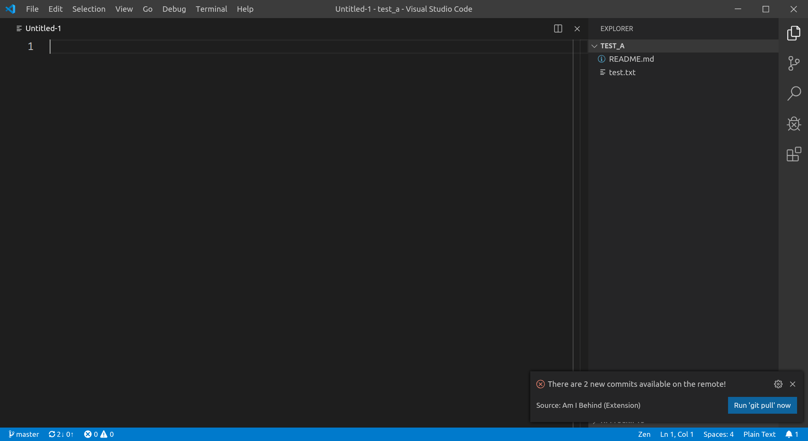

# Am I Behind? [NO UPDATES]

> Since I am not really using VS Code as my main editor anymore, I have stopped development on this extension. Feel free to fork / republish this if you want.

This is a small extension that shows you a notification if you are opening a
project and there are new changes on the remote.

> It is highly advised to run this extension with the configuration
`"git.autofetch"` set to `true`, so that you will get notified without having
to manually run `git fetch` all the time.

## Features

As you can see in the lower right corner there is a very small indicator that
there are new changes to pull from the remote. To make this more obvious this
extension displays a notification if there are new changes to pull from the
remote branch.

The notification is an `error`-notification, because all other notifications in
vscode disappear after a certain amount of time and I wanted them to be sticky.

There is also a button to run `git pull` to obtain the new changes from the
remote.

## Requirements

The official [Git Extension](https://github.com/Microsoft/vscode/tree/master/extensions/git) has to be installed and enabled for this extension to work properly.

## Extension Settings

You can specify the type of the shown notification. This way you can make the
notification sticky, if you set the `"notificationLevel"`-setting to `"error"`.
